# EgoVLA: Learning Vision-Language-Action Models from Egocentric Human Videos
> **论文深度精读与技术全解** | 具身智能 · 视觉-语言-动作大模型 · 双臂人形机器人灵巧操控

---

## 目录
- [1. 论文速览与核心贡献 (TL;DR)](#1-论文速览与核心贡献-tldr)
- [2. 研究背景与痛点：为什么需要从人类视频中学习操控？](#2-研究背景与痛点为什么需要从人类视频中学习操控)
- [3. EgoVLA 核心方法与模型架构](#3-egovla-核心方法与模型架构)
  - [3.1 输入表征与多模态编码](#31-输入表征与多模态编码)
  - [3.2 统一动作空间设计 (Unified Action Space)](#32-统一动作空间设计-unified-action-space)
  - [3.3 动作头架构与训练目标函数](#33-动作头架构与训练目标函数)
  - [3.4 跨具身迁移机制与双向 Retargeting](#34-跨具身迁移机制与双向-retargeting)
- [4. 第一人称人手操控数据集 (Dataset Curation)](#4-第一人称人手操控数据集-dataset-curation)
- [5. Ego Humanoid Manipulation Benchmark (仿真基准)](#5-ego-humanoid-manipulation-benchmark-仿真基准)
- [6. 实验结果与深度定量分析](#6-实验结果与深度定量分析)
  - [6.1 人手运动建模与指令遵循能力](#61-人手运动建模与指令遵循能力)
  - [6.2 人形机器人真机仿真评测：短程与长程操控](#62-人形机器人真机仿真评测短程与长程操控)
  - [6.3 跨域泛化能力 (Seen vs. Unseen Backgrounds)](#63-跨域泛化能力-seen-vs-unseen-backgrounds)
  - [6.4 关键消融实验 (Ablation Studies)](#64-关键消融实验-ablation-studies)
- [7. 轨迹可视化与动作平滑机制](#7-轨迹可视化与动作平滑机制)
- [8. 局限性与未来探索方向](#8-局限性与未来探索方向)
- [9. 核心要点总结 (Key Takeaways)](#9-核心要点总结-key-takeaways)

---

## 1. 论文速览与核心贡献 (TL;DR)

- **论文标题**：EgoVLA: Learning Vision-Language-Action Models from Egocentric Human Videos
- **作者团队**：Ruihan Yang（杨瑞涵）$^*$, Qinxi Yu$^*$, Yecheng Wu, Rui Yan, Borui Li, An-Chieh Cheng, Xueyan Zou, Yunhao Fang, Xuxin Cheng, Ri-Zhao Qiu, Hongxu Yin, Sifei Liu, Song Han（韩松）, Yao Lu, Xiaolong Wang（王小龙）
- **机构合作**：加州大学圣迭戈分校 (UC San Diego)、伊利诺伊大学厄巴纳-香槟分校 (UIUC)、麻省理工学院 (MIT)、英伟达 (NVIDIA)
- **录用/预印**：CoRL 2025 / arXiv: 2507.12440
- **项目主页**：[https://rchalyang.github.io/EgoVLA/](https://rchalyang.github.io/EgoVLA/)

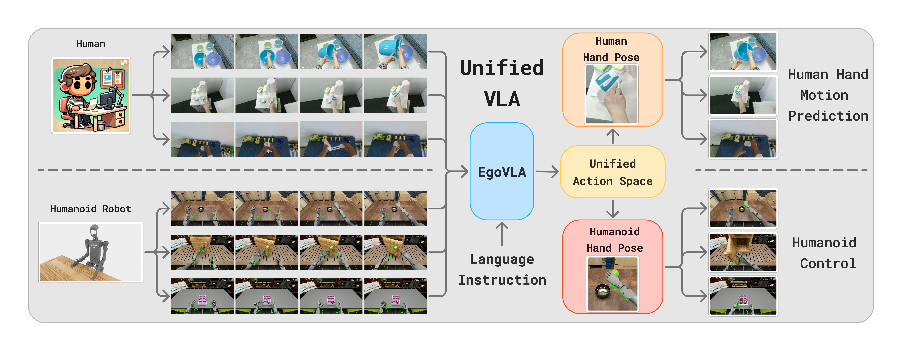
*图 1：EgoVLA 整体概念。顶部展示了人类在海量第一人称视频中展示的丰富操控行为；底部展示了 EgoVLA 将所学技能迁移到双臂 Unitree H1 人形机器人上，借助灵巧手完成各类精细交互。*

### 核心观点与突破
1. **摆脱真机遥操作数据瓶颈**：针对模仿学习极度依赖高成本机器人真机遥操作采集的难题，EgoVLA 提出将全世界 80 亿人类视作“实体机器人”，直接从大规模第一人称（Egocentric）人类视频中预训练通用的视觉-语言-动作（VLA）先验。
2. **统一动作空间与双向 Retargeting**：将人手与机器人手投影到共享的 MANO 手部参数空间（15维 PCA）与手腕 6D 位姿空间。通过最优化拟合与轻量级 MLP 重定向网络，在人类手部表示与人形机器人灵巧手执行器之间建立了几乎无损的映射（指尖平均误差仅 $5\times 10^{-5}\text{m}$）。
3. **两阶段训练体系**：先在 ~50 万对第一人称人手-物体交互视频上进行技能预训练（Pre-training），再利用少量特定任务的机器人演示数据进行微调（Post-training），在显著降低机器人数据需求的同时，获得了极高的任务成功率和域外环境泛化能力。
4. **提出 Ego Humanoid Manipulation Benchmark**：基于 NVIDIA Isaac Lab 构建了包含 12 项双臂复杂操控任务（7 项短程原子任务 + 5 项长程复合任务）、支持 25 种视觉环境组合的高保真人形机器人仿真基准。

---

## 2. 研究背景与痛点：为什么需要从人类视频中学习操控？

近年来，基于大模型架构的具身控制策略（VLA, 如 RT-2, OpenVLA, Octo, $\pi_0$）取得了长足进步。但这一范式面临一个根本性的物理瓶颈：**数据规模与多样性受限**。

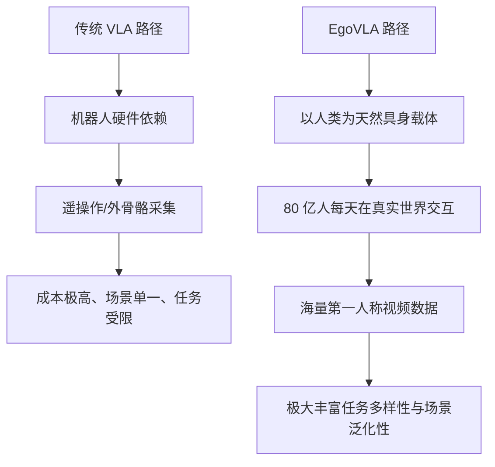

### 传统方法的困境
- **遥操作系统受限**：无论使用 VR 头显（如 Quest 3、Apple Vision Pro）、动捕手套还是外骨骼（如 AirExo、ACE），都需要实体机器人硬件和专业操作员。数据的时长往往停留在几十到几百小时级别，难以支撑大规模多任务泛化。
- **专才策略与泛化困难**：专用策略（如单独训练的 ACT 策略）必须从零同时学习底层物体交互与高层任务规划，一旦环境贴图或物体初始摆放位置发生偏移，策略极易崩溃。

### 核心洞察 (Key Observation)
> **人类的动作空间与双臂人形机器人的动作空间差异并没有想象中那么大，可以通过几何变换进行高精度逼近。**
> 人类操控物体时，最核心的要素是**末端手腕位姿（Wrist Pose）**和**手指关节形态（Hand Articulation）**。只要建立起这一动作先验，模型就已经具备了极高的通用操作“常识”。

---

## 3. EgoVLA 核心方法与模型架构

EgoVLA 的核心架构设计立足于利用预训练视觉-语言多模态大模型（VLM）强大的语义与视觉推理能力，外接高效的 Transformer 动作解码头，实现端到端的时序动作生成。

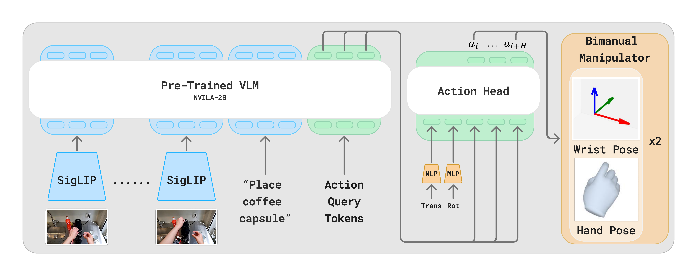
*图 2：EgoVLA 网络架构。模型输入包括历史视觉帧序列、任务语言指令、本体感觉状态（Proprioception）以及动作查询 Token（Action Query Tokens），经过 NVILA-2B 主干网与 6 层 Transformer 动作头，输出未来 1 秒（30 步）的人手/机器人动作序列。*

### 3.1 输入表征与多模态编码

EgoVLA 的多模态输入由四部分构成：
1. **时序视觉观测 ($I_{t-5:t}$)**：
   - 包含当前帧与过去 5 帧第一人称 RGB 图像，采样时间间隔为 $0.2\text{s}$，覆盖过去 $1.0\text{s}$ 的视觉历史。
   - 输入分辨率统一为 $384 \times 384$，保留高分辨率的物体细节与手物接触信息。
2. **语言指令 ($L$)**：
   - 描述即时需要执行的具体技能行为（例如 *"Push box to the marker"*, *"Open the closed drawer"*）。短程技能语言避免了高层抽象规划的语义漂移，使模型聚焦于具体操作执行。
3. **本体感觉状态 ($S_{\text{proprio}}$)**：
   - 包含双手手腕的三维平移向量、三维旋转矩阵以及手部关节参数。在输入动作头之前，先经过小型 MLP 投影到隐藏特征维度。
4. **动作查询标记 (Action Query Tokens)**：
   - 在语言词表中选取最后 $H=30$ 个词 ID 作为可学习的动作查询 Query，用来引导模型并行自回归/前向输出时序动作。

### 3.2 统一动作空间设计 (Unified Action Space)

为了无缝整合人类视频数据与机器人遥操作数据，作者设计了一套基于 **MANO** 手部模型与相机坐标系手腕位姿的**统一动作空间**：

$$\mathbf{A}_t = \{ \mathbf{a}_{\text{left}}, \mathbf{a}_{\text{right}} \}$$

其中单手动作向量包含：
- **手腕平移 (Wrist Translation)**：$\mathbf{T} \in \mathbb{R}^3$，在当前第一人称相机坐标系下的 3D 位移。
- **手腕旋转 (Wrist Rotation)**：$\mathbf{R} \in \mathbb{R}^6$，采用 6D 连续旋转表示法 (rot6D)，避免欧拉角的万向节死锁和四元数的双重覆盖不连续性。
- **手部形态 (Hand Pose)**：$\mathbf{\Theta} \in \mathbb{R}^{15}$，采用 MANO 模型的 Top-15 主成分分析（PCA）分量。标准 MANO 包含 15 个球形关节（45 个自由度），但人手解剖结构存在运动协同性（Synergy），前 15 个 PCA 维度即可极高保真度重构抓握、开合等复杂指尖动作，同时大幅压缩学习难度。

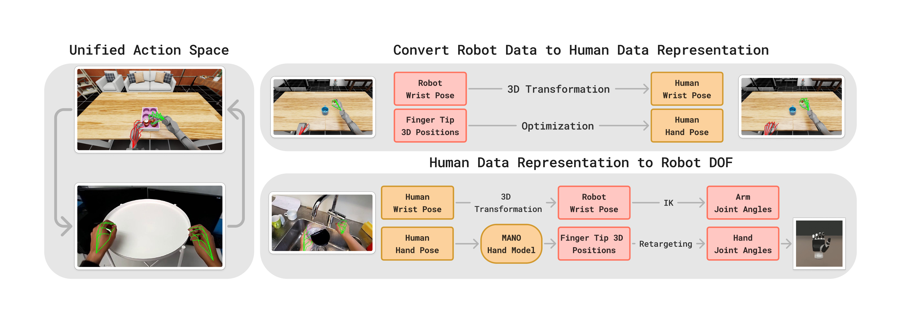
*图 3：统一动作空间与双向 Retargeting 机制。训练期：通过优化算法将机器人示教数据映射到 MANO 参数空间；推理部署期：EgoVLA 预测 MANO 参数计算指尖关键点，再由轻量 MLP 映射为灵巧手关节电机控制指令。*

### 3.3 动作头架构与训练目标函数

#### 骨干网与动作头 (Backbone & Action Head)
- **VLM 骨干网络**：采用 **NVILA-2B**。模型体量小巧（20 亿参数），兼备强大的图文交互理解能力与高微调吞吐率。
- **Transformer 动作头**：参数量约为 300M，包含 6 层 Transformer Encoder，隐藏层维度为 1536。它接收经过 VLM 编码的视觉语言上下文、动作 Query 潜变量以及本体感觉表征，单次预测未来 1 秒内（30 个时间步，30 Hz）的双手轨迹块（Action Chunking）。

#### 联合损失函数 (Optimization Objective)
模型输出未来步的手腕位姿与手关节参数，损失函数由三项加权组成：

$$\mathcal{L} = \lambda_{\text{wrist trans}}\mathcal{L}_{\text{wrist trans}} + \lambda_{\text{wrist rot}}\mathcal{L}_{\text{wrist rot}} + \lambda_{\text{joint}}\mathcal{L}_{\text{joint}}$$

其中：
- **平移损失**：$\mathcal{L}_{\text{wrist trans}} = \|\mathbf{T}_{\text{pred}} - \mathbf{T}_{\text{gt}}\|_2^2$
- **旋转损失**：将预测的 rot6D 矩阵正交化还原为 $3\times 3$ 旋转矩阵后再计算 L2 误差：$\mathcal{L}_{\text{wrist rot}} = \|\mathbf{R}_{\text{pred}} - \mathbf{R}_{\text{gt}}\|_2^2$
- **关节损失**：$\mathcal{L}_{\text{joint}} = \|\mathbf{\Theta}_{\text{pred}} - \mathbf{\Theta}_{\text{gt}}\|_2^2$
- **平衡超参数**：实验中固定设为 $\lambda_{\text{wrist trans}} = 20.0$, $\lambda_{\text{wrist rot}} = 5.0$, $\lambda_{\text{joint}} = 5.0$。

---

### 3.4 跨具身迁移机制与双向 Retargeting

人类手与机器人机械灵巧手在几何外形、尺寸比例、自由度约束上存在显著差异（Embodiment Gap）。EgoVLA 提出了优雅的**离线对齐**与**在线解析**双向桥接方案：

#### 1. 离线训练期：机器人动作向人手 MANO 对齐 (Robot $\to$ Human)
当获取到机器人真机/遥操作数据时，需要将其转化为统一的 MANO 表示以供微调。对于末端手腕，直接使用 3D 刚体坐标变换；对于机器人手指，通过最优化算法求解一组最优的 MANO 参数 $\mathbf{\Theta}^*$，使得根据 MANO 正向运动学（FK）计算出的 5 个指尖位置与实际观察到的机器人指尖位置误差最小：

$$\underset{\mathbf{\Theta}}{\text{minimize}} \quad \mathcal{L}(\mathbf{\Theta}) = \frac{1}{5} \sum_{i=1}^{5} \text{SmoothL1}\left(\mathbf{J}_{\text{pred}}(\mathbf{\Theta})_i, \mathbf{J}_{\text{obs},i}\right)$$

其中 $\mathbf{J}_{\text{pred}}(\mathbf{\Theta}) \in \mathbb{R}^{5\times 3}$ 为 MANO 正向解算出的五指指尖位置，$\mathbf{J}_{\text{obs}} \in \mathbb{R}^{5\times 3}$ 为机器人观测到的指尖空间坐标。通过该优化，不同构型的灵巧手数据均能被标准化为统一维度的人手向量。

#### 2. 在线部署期：人手动作向机器人控制器解算 (Human $\to$ Robot)
在实际部署推理时，EgoVLA 预测出的双手动作需要快速解算给机器人执行机构：
1. **手臂控制**：预测的手腕位姿经由坐标变换为机器人手臂末端执行器（End-Effector, EE）目标位姿，通过**逆运动学 (IK)** 解析求解手臂关节角。
2. **手部控制**：预测的 MANO 参数经正向运动学计算得到 3D 手部关键点，再送入一个专门训练的**轻量 Retargeting MLP**（4层神经网络，隐层维度 `[64, 128, 64]`），实时回归出双手机械手的所有自由度（DOFs）控制命令。
3. **精度保证**：该 Retargeting MLP 在整个测试集上的指尖平均位置误差仅为 $5 \times 10^{-5}\text{m}$（0.05 毫米！），将重定向动作重新输入仿真器重放，原始演示的任务成功率 100% 保持，证明了几何映射几乎没有引入控制失真。

---

## 4. 第一人称人手操控数据集 (Dataset Curation)

模型从单一数据源预训练容易过拟合到特定采集设备或场景。作者整合并标准化了 4 个主流第一人称人手交互数据集，涵盖单手交互、双手协作与工具使用：

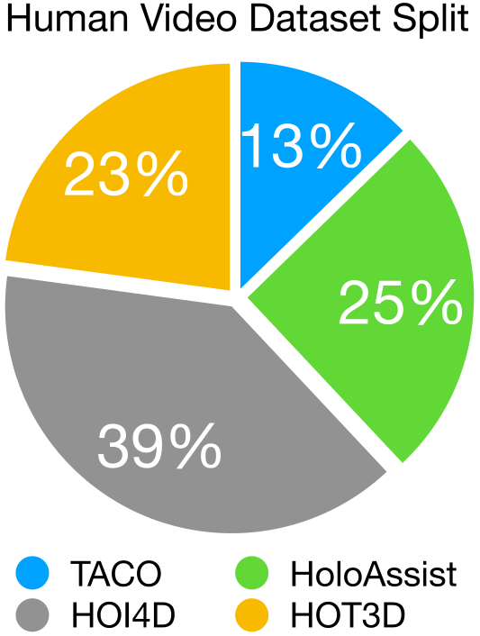
*图 4：预训练数据集构成比例。巧妙平衡了高精度动捕与大规模自然复杂场景。*

| 数据集来源 | 原始规模 | 数据特点与标注质量 | 预训练处理策略 |
| :--- | :--- | :--- | :--- |
| **HOI4D** | 4,000 个视频 | 涵盖丰富的单手交互（抓取、重定向、铰接物体操作），有准确语言标签 | 保留完整序列，提供高质量单手基础技能 |
| **HOT3D** | 833 分钟 | 33 种刚性物体交互，具备极其精准的 3D 手部和相机姿态 | 缺失语言描述，引入统一的占位语言指令 |
| **HoloAssist** | 166 小时 | 涵盖复杂的双手日常任务（换电池、装家具等），场景极丰富，但手部姿态噪声大 | **均匀下采样 1/10**，防止带噪数据淹没模型；重定向至 MANO 格式 |
| **TACO** | 2,317 个序列 | 覆盖 151 组“工具-动作-物体”三元组，专注于双手精细工具操控 | 提取完整轨迹作为多步交互补充 |

### 关键数据工程
- **相机运动去耦合**：在第一人称视界下，佩戴者的头部转动会导致剧烈的背景位移。为了提供确定一致的监督信号，利用世界坐标系下的相机姿态，将未来的手腕绝对位置动态投影到**当前帧的相机坐标系**中。
- **采样策略**：RGB 观测以 3 FPS 进行下采样，平衡计算开销与时间连续性。
- **数据总量**：最终得到约 **500,000 对“图像-动作”高质量样本**。

```carousel
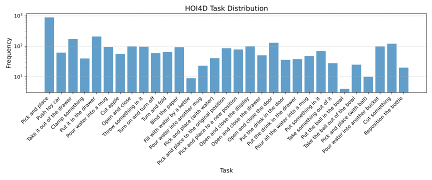
<!-- slide -->
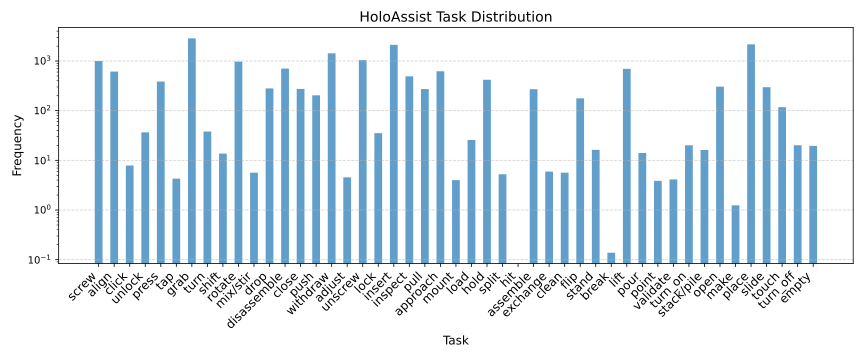
<!-- slide -->
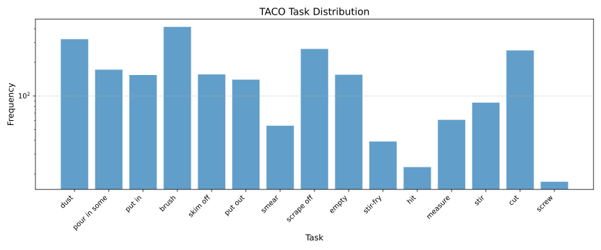
```
*图 5：各第一人称数据集任务与动词分布对数直方图，展现出从开门、倒水到工具装配的丰富多态性。*

---

## 5. Ego Humanoid Manipulation Benchmark (仿真基准)

为了彻底摆脱真机评测评测耗时长、不可复现且存在安全碰撞隐患的限制，作者基于 **NVIDIA Isaac Lab (Isaac Sim)** 构建了一套高标准的物理仿真基准——**Ego Humanoid Manipulation Benchmark**。

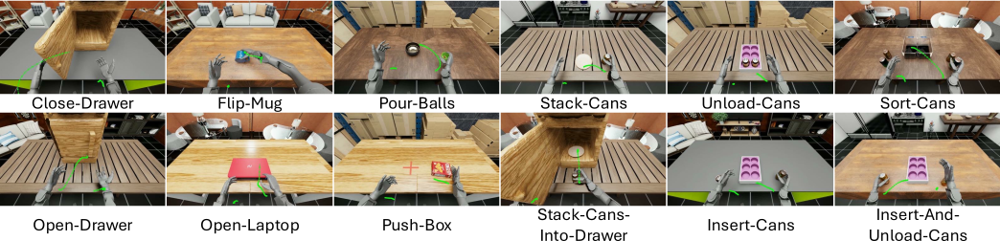
*图 6：12 个仿真操控任务环境与 EgoVLA 预测的手腕轨迹。前 7 个为短程原子任务，后 5 个为多阶段长程复合任务。*

### 5.1 机器人与控制规格
- **人形机体**：采用 **Unitree H1** 双臂人形机器人。
- **末端执行器**：双手装配 **Inspire 灵巧手**，每只手拥有 12 个自由度（6 个主动关节，6 个联动仿生关节）。
- **复合控制流**：手臂采用末端执行器（EE）位姿控制，灵巧手采用 PD 关节位置控制。控制频率严格保持在 **30 Hz**。
- **动作空间维度**：结合双臂逆运动学与双手 24 个关节，系统动作维度达到 **36 维**。

### 5.2 任务体系设计
基准包含 12 个代表性任务，划分严密：

| 任务类型 | 任务名称 | 语言指令 (Prompt) | 终止与子任务完成判断标准 |
| :--- | :--- | :--- | :--- |
| **短程原子任务** | **Push-Box** | *"Push box to the marker"* | 盒子与目标 Marker 距离 $< 8\text{cm}$ |
| | **Flip-Mug** | *"Flip the mug"* | 杯子世界坐标系下朝上的 Z 轴分量 $> 0.5$ |
| | **Pour-Balls** | *"Pour balls in cup into bowl"* | 至少有 3 颗小球落入碗内 |
| | **Close-Drawer** | *"Close the opened drawer"* | 抽屉完全闭合 |
| | **Open-Drawer** | *"Open the closed drawer"* | 抽屉完全拉开 |
| | **Open-Laptop** | *"Open the laptop"* | 笔记本屏幕开启度 $\ge 70\%$ |
| | **Stack-Can** | *"Put can on the saucer"* | 易拉罐水平偏离盘中心在半径内且垂直间距 $< 2\text{cm}$ |
| **长程复合任务** | **Sort-Cans** | *"Put sprite cans to the left box, and orange cans to the right box"* | 双手分类：2 听雪碧放入左盒，2 听芬达放入右盒 |
| | **Insert-Cans** | *"Insert cans into the boxes"* | 拿起并准确将多听易拉罐插入对应卡槽 |
| | **Unload-Cans** | *"Unload the right cans and then unload the left cans"* | 从槽位中将易拉罐取出并平稳立在桌面上 |
| | **Insert-And-Unload-Cans**| *"Insert... and then unload..."* | 先插入槽位，随后逐一卸载立于桌面（多步时序协同） |
| | **Stack-Can-Into-Drawer**| *"Put can on the saucer, and Close the drawer"* | 将罐子码放到托盘上，随后推上抽屉门 |

### 5.3 严格的泛化性测试机制
- **25 种视觉背景矩阵**：引入 5 种房间环境贴图（Room 1–5）与 5 种桌面材质（Table 1–5）。训练集仅使用 Room 1-3 和固定 Table 1（共 3 种 Seen 组合），剩余 **22 种全新组合全部作为 Unseen 域外测试集**！
- **空间位置随机化**：物体生成位置在矩形区域内随机漂移（范围最高达 $20\text{cm} \times 20\text{cm}$），评估策略的空间适应度。
- **专家示范**：使用 Meta Quest 3 配合 OpenTelevision 系统远程采集，每个任务仅收集 **100 条成功轨迹**（长度 100~500 帧）。

---

## 6. 实验结果与深度定量分析

评测指标采用：
- **Success Rate (SR)**：最终任务达成率（百分比）。
- **Progress Rate (PSR)**：长程任务中完成的阶段性子目标比例（反映执行完成度与部分成功情况）。

### 6.1 人手运动建模与指令遵循能力

在直接迁移到机器人之前，首先测试 EgoVLA 对人类自身第一人称动作的建模能力：
- 在 HOI4D 测试集上，EgoVLA 预测未来手腕平移的平均三维绝对误差约为 **$8\text{cm}$**；投影到 2D 图像平面上的归一化误差约为 **$0.13$**，完全达到并媲美 HOI-forecast 等专用动捕预测 SOTA 模型。
- **语义理解对抗测试**：在保持输入视觉完全不变的情况下，动态修改文本指令，观察预测轨迹的变化：

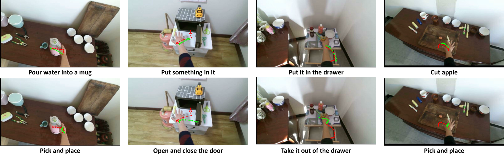
*图 7：视觉指令遵循能力测试。红色为真实人手轨迹，绿色为模型预测。当指令从“放进抽屉”改为“拿出抽屉”时，预测轨迹自适应反转；当指令改为“开关柜门”时，轨迹精准变向至门把手。*

---

### 6.2 人形机器人真机仿真评测：短程与长程操控

#### 对比基线
1. **ACT (Action Chunking with Transformer)**：采用当前模仿学习黄金基线，为每个任务单独训练一个专用专家策略，并将视觉 Backbone 升级为强大的 DinoV2。
2. **EgoVLA-NoPretrain**：使用相同的 NVILA-2B 架构与动作头，但**跳过人类视频预训练**，直接在机器人示范数据上从零微调。
3. **EgoVLA (50%)**：经过人类视频预训练，但微调时仅使用 50 条（50%）机器人示教。
4. **EgoVLA (Full)**：完整两阶段流程（人类视频预训练 + 100 条示教微调）。

#### 表 1：短程任务评测结果（Seen / Unseen 背景）

| 评测环境            | 方法 (Method)           |     Stack-Can     |     Push-Box      |    Open-Drawer    |   Close-Drawer    |     Flip-Mug      |    Pour-Balls     |    Open-Laptop    |      **均值 Mean SR / PSR**      |
| :-------------- | :-------------------- | :---------------: | :---------------: | :---------------: | :---------------: | :---------------: | :---------------: | :---------------: | :----------------------------: |
| **Seen 域内背景**   | **ACT**               |    22.2 / 22.2    |    11.1 / 85.2    |    18.5 / 66.7    |    48.1 / 96.3    |     7.4 / 7.4     |    3.7 / 77.8     |    63.0 / 63.0    |       **24.87 / 59.79**        |
|                 | **EgoVLA-NoPretrain** |    55.6 / 55.6    |    51.9 / 75.9    |    59.3 / 77.8    |   100.0 / 100.0   |     3.7 / 3.7     |    85.2 / 93.8    |    96.3 / 96.3    |       **64.55 / 71.87**        |
|                 | **EgoVLA (50%)**      |    44.4 / 44.4    |    33.3 / 66.7    |    22.2 / 61.7    |   100.0 / 100.0   |    22.2 / 22.2    |    77.8 / 92.6    |    37.0 / 44.4    |       **48.15 / 61.73**        |
|                 | **EgoVLA (Ours)**     | **77.78 / 77.78** | **70.37 / 83.33** | **59.26 / 81.48** | **100.0 / 100.0** | **59.26 / 59.26** | **77.78 / 92.59** | **100.0 / 100.0** | <mark>**77.78 / 84.92**</mark> |
| **Unseen 域外背景** | **ACT**               |    9.1 / 10.6     |    18.2 / 87.9    |    24.2 / 72.0    |    63.6 / 97.0    |     0.0 / 0.0     |    6.1 / 59.1     |    53.0 / 53.0    |       **24.89 / 54.22**        |
|                 | **EgoVLA-NoPretrain** |    57.6 / 57.6    |    69.7 / 82.6    |    46.2 / 71.3    |    86.4 / 89.9    |     4.7 / 4.7     |    46.0 / 79.4    |    48.5 / 53.0    |       **51.28 / 62.63**        |
|                 | **EgoVLA (Ours)**     | **62.12 / 62.12** | **75.76 / 84.85** | **50.00 / 75.25** | **98.48 / 98.48** | **30.77 / 30.77** | **83.33 / 94.44** | **83.33 / 87.88** | <mark>**69.11 / 76.26**</mark> |

#### 表 2：长程复合任务评测结果（Seen / Unseen 背景）

| 评测环境 | 方法 (Method) | Insert & Unload | Stack into Drawer | Sort-Cans | Unload-Cans | Insert-Cans | **均值 Mean SR / PSR** |
| :--- | :--- | :---: | :---: | :---: | :---: | :---: | :---: |
| **Seen 域内背景** | **ACT** | 0.0 / 11.1 | 11.1 / 37.0 | 0.0 / 28.6 | 0.0 / 35.8 | 0.0 / 19.8 | **2.22 / 26.47** |
| | **EgoVLA-NoPretrain** | 7.4 / 45.9 | 0.0 / 18.5 | 51.9 / 79.6 | 63.0 / 75.0 | 11.1 / 55.6 | **26.67 / 54.93** |
| | **EgoVLA (50%)** | 0.0 / 28.2 | 29.6 / 57.4 | 0.0 / 33.3 | 0.0 / 30.6 | 7.4 / 49.1 | **7.41 / 39.70** |
| | **EgoVLA (Ours)** | **44.44 / 77.04** | **40.74 / 75.93** | **55.56 / 88.89** | **66.67 / 83.33** | **22.22 / 78.70** | <mark>**45.93 / 80.78**</mark> |
| **Unseen 域外背景**| **ACT** | 0.0 / 8.0 | 1.5 / 33.8 | 0.0 / 20.7 | 1.5 / 33.8 | 0.0 / 21.2 | **0.61 / 23.51** |
| | **EgoVLA-NoPretrain** | 0.0 / 29.1 | 0.0 / 20.1 | 15.2 / 45.8 | 34.8 / 55.7 | 6.1 / 30.3 | **11.21 / 36.20** |
| | **EgoVLA (Ours)** | **31.82 / 76.97** | **28.79 / 60.98** | **18.18 / 68.94** | **50.00 / 75.76** | **15.15 / 62.88** | <mark>**28.79 / 69.11**</mark> |

---

### 6.3 跨域泛化能力 (Seen vs. Unseen Backgrounds)

数据展现出两个极其震撼的结论：
1. **通用 VLA 对专家 ACT 的降维打击**：
   - ACT 在短程任务上勉强达到 24.87% 的成功率，在长程任务上几乎全军覆没（Seen SR 仅 2.22%，Unseen 仅 0.61%）。这是因为专家策略缺乏预训练视觉表征和跨任务的技能共享，必须在 100 条示范中硬背全局轨迹，遇到稍微复杂的长程逻辑便失去鲁棒性。
2. **人类预训练赋予了超强抗过拟合能力**：
   - 在未见过的 22 种背景下，未进行人手预训练的 `EgoVLA-NoPretrain` 性能出现**断崖式暴跌**：长程任务平均 SR 从 26.67% 跌至 11.21%，短程任务下跌超 13 个百分点。
   - 相比之下，`EgoVLA` 展现出惊人的稳定性：在 Unseen 背景下仍维持 **69.11% 的短程成功率** 与 **69.11% 的长程完成度（PSR）**！即使最终操作偶发失误，长程任务的中间进度（PSR）与 Seen 环境几乎持平，说明人类视频中的丰富光影、杂乱背景与几何多态性帮助策略建立了真正鲁棒的“手-物交互物理感知”。

---

### 6.4 关键消融实验 (Ablation Studies)

#### 消融 1：完全 Zero-Shot 为什么为 0%？
> [!WARNING]
> **EgoVLA 无法做到未经微调的零样本真机执行（Zero-Shot SR = 0%）。**
> 论文诚实地指出：尽管统一动作空间完成了几何维度的投影，但人类视频与仿真环境之间仍然存在无法忽视的感知差距（人手皮肤纹理 vs. 金属机械臂外观、鱼眼相机畸变与视角差异、动力学接触响应差异）。因此，**少量目标域机器人演示（In-Domain Post-training）是必不可少的对齐校准步骤**。

#### 消融 2：机器人示教数据量的敏感度 (100% vs. 50%)
- 当微调数据缩减至 50%（仅 50 条示教）时，`EgoVLA (50%)` 的长程任务成功率从 45.93% 暴跌至 7.41%。这印证了虽然人类视频构建了广阔的技能基础，但长程复合任务的多阶段切换和累积误差纠偏依然需要适量的机器人交互数据进行“固化”。

#### 消融 3：预训练数据配比的扩展效应 (Scaling Data Mixture)
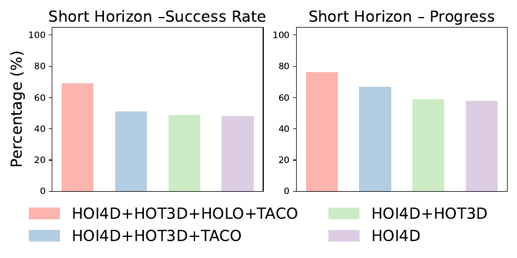
*图 8：预训练数据构成消融实验。从单数据集逐步增加数据规模和任务多样性，下游任务的成功率与进度呈现严格单调递增。*

作者系统性验证了数据多样性的威力：
- 仅用 HOT3D $\to$ 加入 HOI4D $\to$ 加入 TACO $\to$ 加入 HoloAssist（全量混合）。
- 结果表明：下游任务的 SR 与 PSR 呈现**严格的单调上升趋势**。甚至即使 HoloAssist 的手势估计存在显著噪点、HOT3D 缺失具体语言描述，异构混合仍带来了积极的正向迁移，证明了大模型架构对真实世界低质、弱标注人类视频数据具有强大的容错与抽象能力。

#### 消融 4：工作空间空间分布特性 (Spatial Distribution)
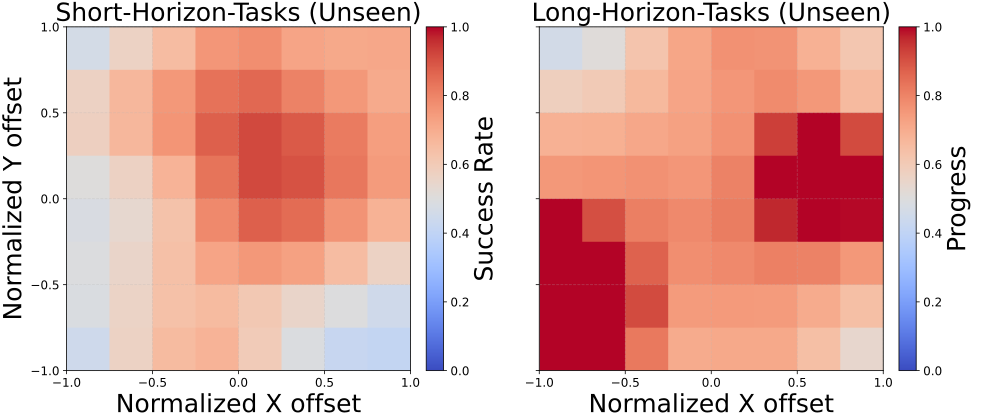
*图 9：不同物体生成位置下的成功率热力图。短程单手任务（左）在几何中心呈现高成功率；长程双手协作任务（右）呈现出明显的“左右双峰”成功区域。*

热力图揭示了双手协同操作的物理机理：
- **短程原子任务**：大多数为单臂推/拉/拿，因此机器人在视野正中心操作最为稳健，边缘区域由于手臂可达域（Reachability）限制成功率下降。
- **长程复合任务**：热力图清晰地呈现出**左、右两个高概率分离峰值**。这是因为像 Sort-Cans、Insert-And-Unload-Cans 等任务涉及双臂分别抓取左侧与右侧物体，双峰精准对应了机器人左右手臂各自最优的操作工作空间。

---

## 7. 轨迹可视化与动作平滑机制

### 7.1 推理平滑与 Action Chunking
EgoVLA 单次预测 30 步动作（对应 1 秒时域）。在机器人在线执行中，为了防止由于帧间预测微小偏差导致的电机高频振颤，系统引入了类似 ALOHA 的**时间聚合动作块平滑机制（Action Chunking with Temporal Ensemble）**，平滑衰减系数设定为 **0.8**。这一处理显著提升了双臂运动的平滑轨迹与机械机构的耐受度。

### 7.2 任务轨迹可视化

```carousel
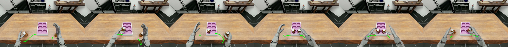
<!-- slide -->
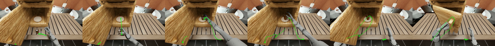
<!-- slide -->
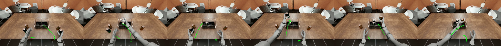
<!-- slide -->
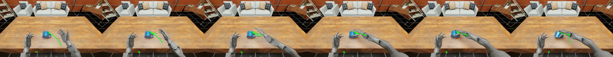
```
*图 10：长程与短程机器人执行轨迹图（绿线为 EgoVLA 前向预测的手腕轨迹）。展示了灵巧手抓取、对齐、插入、释放等一系列极度连续流畅的高维动作。*

而在人手预测方面，模型即使在完全未见过的真实家庭场景下，也能准确预测使用小刀切苹果、推开储物柜门、将水壶精确倒入水杯等复杂接触动作：

```carousel
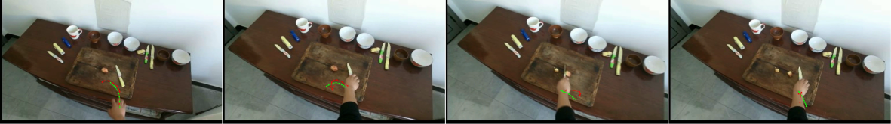
<!-- slide -->
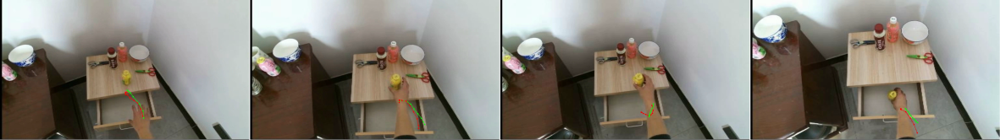
<!-- slide -->
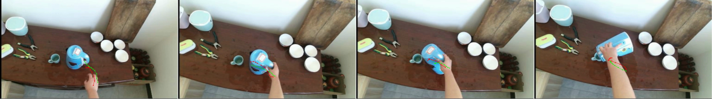
```
*图 11：在 HOI4D 测试集上的第一人称人手预测轨迹（绿线为预测，红线为真实 Ground Truth）。*

---

## 8. 局限性与未来探索方向

论文在第 7 节深入剖析了本方案的现实瓶颈：
1. **对 3D 姿态标注的依赖**：
   - 预训练需要人手 MANO 参数和相机位姿作为监督标签。目前开源数据主要来源于配备动捕或红外传感的 AR/VR 头显（如 Quest 3、Apple Vision Pro、Aria 眼镜）。未来的方向应探索基于无标注野生视频（In-the-Wild Video）的自监督学习（如无标注手势追踪或逆动力学模型）。
2. **未能实现纯 Zero-Shot 跨具身直出**：
   - 当前在没有任何真机示范的情况下成功率为 0%。如何设计形态无关（Embodiment-Agnostic）的通用隐空间，实现无需任何真机微调即可直接部署，是具身智能极具吸引力的终极圣杯。
3. **触觉与力反馈缺失**：
   - 依赖纯视觉进行灵巧手操控对于高摩擦力、精密卡扣插拔任务仍有容错率上限，未来需结合接触力传感器（Tactile Sensor）与视触融合模型。

---

## 9. 核心要点总结 (Key Takeaways)

> [!TIP]
> ### 💡 为什么 EgoVLA 值得被高度关注？
> 1. **破局具身数据孤岛**：证实了**海量第一人称人类交互视频可以直接转译为机器人灵巧手操作技能**，为具身智能走出“百万真机遥操作数据昂贵泥潭”开辟了一条可规模化的康庄大道。
> 2. **几何统一设计极具工程美感**：通过 MANO 空间对齐与轻量 Retargeting MLP（误差 0.05mm），巧妙消解了不同灵巧手硬件自由度不一的异构难题。
> 3. **泛化性能树立新标杆**：在未见过的复杂光影、杂乱纹理背景中展现出近乎免疫的泛化能力，远超从零训练的专用策略。
> 4. **基准价值**：所开源的基于 NVIDIA Isaac Lab 的 **Ego Humanoid Manipulation Benchmark** 填补了双臂人形机灵巧操作缺乏统一可复现评测环境的行业空白。
